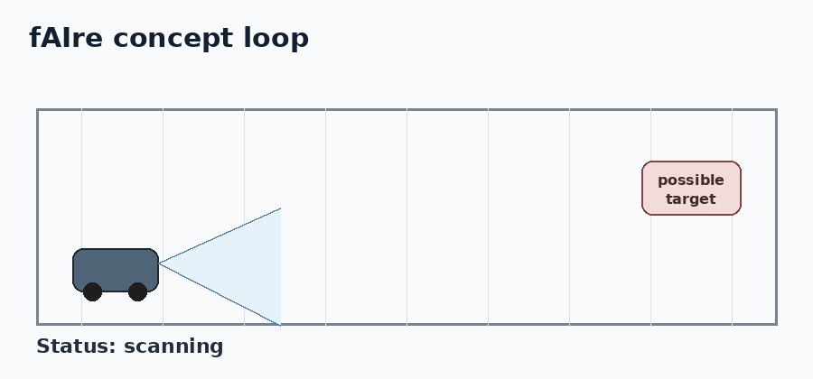
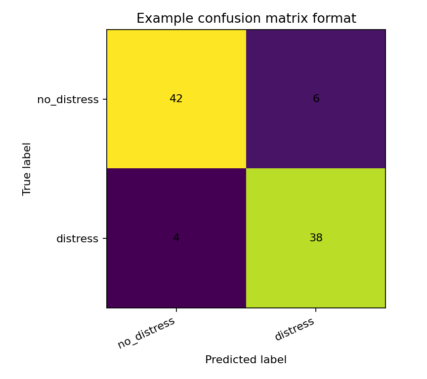
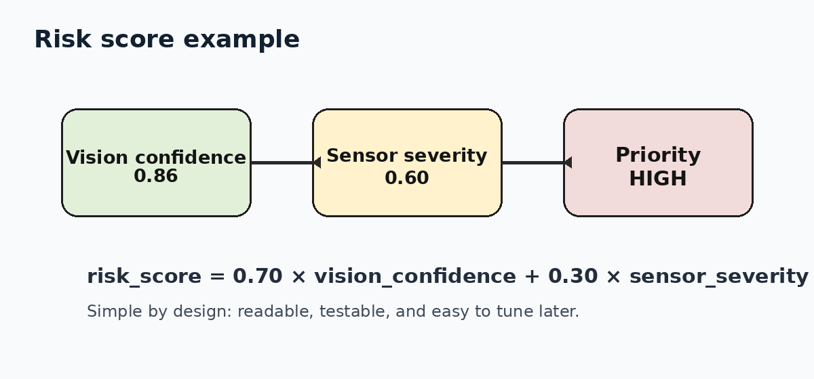

# fAIre — Search-and-Rescue Robot Vision System

> A personal robotics + computer-vision project exploring how a small rover could help search fire-scene environments with camera input, lightweight AI, and simple sensor-based risk scoring.

<p align="center">
  
</p>

fAIre started as a hands-on robotics experiment and evolved into a more complete software pipeline: prepare image data, train a lightweight vision model, evaluate it with recall-focused metrics, run inference on images/video/webcam, and combine AI confidence with sensor readings to produce search-priority alerts.

The project is intentionally built like a prototype, not a perfect finished product. The public repo contains the reusable code and documentation. Large datasets, trained weights, and private/raw test media are kept out of git.

---

## What the project does

fAIre is organized around a simple idea: a robot in a dangerous environment should not just “detect something.” It should turn camera and sensor input into an alert that is useful to a human operator.

Current capabilities:

- **Image classifier training** using PyTorch transfer learning with MobileNetV2.
- **Dataset preparation** from raw class folders into train/validation/test splits.
- **Evaluation** with precision, recall, F1 score, support, and a saved confusion matrix.
- **Threshold tuning** for a recall-first operating point.
- **Inference** on image files, video files, or webcam streams using OpenCV.
- **Risk scoring** that combines model confidence with temperature/smoke/CO-style sensor values.
- **Arduino sensor streaming** sketch for hardware readings over serial.

<p align="center">
  
</p>

---

## Tech stack

| Layer | Tools used | Why it is used |
|---|---|---|
| Training | **PyTorch**, torchvision | Transfer learning, checkpointing, reproducible model code |
| Model | **MobileNetV2** | Lightweight CNN suitable for edge/robotics experiments |
| Data prep | Python, Pillow | Clean class folders, resize images, create train/val/test splits |
| Evaluation | scikit-learn, matplotlib | Precision, recall, F1, confusion matrix |
| Inference | OpenCV, PyTorch | Run on image, video, or webcam frames |
| Hardware | Arduino-style serial sketch | Stream simple sensor readings to the AI layer |
| Testing | pytest | Keep core risk-scoring logic stable |

---

## System architecture

<p align="center">
  
</p>

```text
Camera / robot sensors
        |
        v
Frame preprocessing + sensor parsing
        |
        v
PyTorch MobileNetV2 classifier
        |
        v
Risk engine: model confidence + sensor severity
        |
        v
Search-priority alert for operator
```

The current public version is a **frame-level classifier pipeline**. It predicts whether an input frame appears to contain the target condition, then converts that signal into a structured alert. A future version can swap the classifier for an object detector to localize the person or hazard with bounding boxes.

More detail:

- [`docs/ARCHITECTURE.md`](docs/ARCHITECTURE.md)
- [`docs/TRAINING.md`](docs/TRAINING.md)
- [`docs/HARDWARE.md`](docs/HARDWARE.md)

---

## Repository structure

```text
fAIre---Search-and-Rescue/
├── configs/              # example training configuration
├── data/                 # dataset preparation script and dataset notes
├── demo/                 # evaluation and threshold-tuning scripts
├── docs/                 # architecture, training, and hardware writeups
├── hardware/             # Arduino sensor-streaming sketch
├── inference/            # model inference and risk scoring
├── media/                # diagrams and generated example visuals
├── models/               # local model outputs; trained weights are gitignored
├── tests/                # pytest tests
├── training/             # PyTorch transfer-learning pipeline
├── requirements.txt
└── README.md
```

---

## Quickstart

Clone the repo:

```bash
git clone https://github.com/aryapathak33/fAIre---Search-and-Rescue.git
cd fAIre---Search-and-Rescue
```

Create and activate a virtual environment:

```bash
python -m venv .venv

# Windows PowerShell
.venv\Scripts\Activate.ps1

# macOS / Linux
source .venv/bin/activate
```

Install dependencies:

```bash
pip install -r requirements.txt
```

Run tests:

```bash
pytest -v
```

---

## Dataset format

The training code uses the standard `torchvision.datasets.ImageFolder` layout:

```text
data/
├── train/
│   ├── distress/
│   └── no_distress/
├── val/
│   ├── distress/
│   └── no_distress/
└── test/
    ├── distress/
    └── no_distress/
```

The class names can be changed as long as the same folders exist in `train`, `val`, and `test`.

To split raw class folders into train/validation/test:

```bash
python data/prepare_data.py --raw data/raw --out data --val-split 0.15 --test-split 0.15
```

Expected raw format:

```text
data/raw/
├── distress/
└── no_distress/
```

Large datasets should stay outside GitHub. The repo keeps the code and format, not the full image collection.

---

## Train the model

```bash
python training/train.py --data data --epochs 10 --out models/fire_model.pt
```

For a faster first pass:

```bash
python training/train.py --data data --epochs 5 --freeze-backbone --out models/fire_model.pt
```

The training script uses:

- PyTorch
- torchvision `ImageFolder`
- MobileNetV2 pretrained weights
- data augmentation
- AdamW optimizer
- cross-entropy loss
- best-validation checkpoint saving

Saved outputs:

```text
models/fire_model.pt      # PyTorch checkpoint
models/fire_model.json    # lightweight metadata
```

---

## Evaluate the model

```bash
python demo/evaluate.py --data data --weights models/fire_model.pt --threshold 0.50
```

This creates:

```text
media/confusion_matrix.png
media/metrics.json
```

<p align="center">
  
</p>

The public repo does not claim benchmark numbers without the matching dataset and trained weights. Once a real dataset is added locally, `demo/evaluate.py` prints the measured precision, recall, and F1 score from the held-out test folder.

---

## Run inference

Image:

```bash
python inference/detect.py --input data/samples/example.jpg --weights models/fire_model.pt --conf 0.50 --out media/prediction.jpg
```

Video:

```bash
python inference/detect.py --input media/demo_input.mp4 --weights models/fire_model.pt --conf 0.50 --out media/demo_output.mp4
```

Webcam:

```bash
python inference/detect.py --input 0 --weights models/fire_model.pt --conf 0.50
```

The inference script prints JSON-like alert events so the output can later be connected to a dashboard, logger, or radio/command-station interface.

Example alert shape:

```json
{
  "alert": true,
  "label": "distress",
  "confidence": 0.86,
  "risk_score": 0.78,
  "priority": "high",
  "message": "HIGH search priority: possible distress detected."
}
```

---

## Risk scoring

The model confidence is not the whole system. A robot can also use sensor values to make the alert more useful.

<p align="center">
  
</p>

The current risk score is intentionally simple and readable:

```text
risk_score = 0.70 * vision_confidence + 0.30 * sensor_severity
```

Where sensor severity is based on the strongest available environmental signal such as smoke, temperature, or CO-style sensor readings.

---

## Current project status

Implemented:

- End-to-end folder structure
- PyTorch training pipeline
- Data split/preprocessing script
- Evaluation and confusion matrix generation
- Threshold-tuning demo
- Image/video/webcam inference
- Risk-scoring module
- Arduino sensor-streaming sketch
- Unit tests for risk scoring
- Architecture/training/hardware docs

Not committed to the public repo:

- Full raw dataset
- Trained model weights
- Private test clips or hardware footage

That keeps the repo lightweight and avoids publishing large files or unverified metrics.

---

## Roadmap

- Collect a cleaner fire/search-scene dataset.
- Train and evaluate the MobileNetV2 classifier on the held-out test split.
- Replace frame-level classification with object detection for bounding boxes.
- Add thermal-camera input.
- Parse live serial sensor values directly during inference.
- Build a small web dashboard for live alerts.
- Test edge deployment on Raspberry Pi or Jetson-style hardware.

---

## Project origin

This project began as a self-taught robotics build and grew into a more complete AI robotics system. The goal is to keep improving it piece by piece: better data, better sensing, better model evaluation, and eventually a more realistic search-and-rescue demo.
