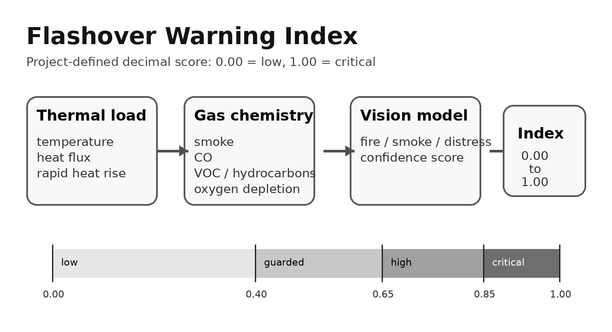

# Flashover warning model

Flashover is one of the most dangerous rapid-growth events in a fire scene. In simple terms, it is the point where heat builds enough that exposed combustible materials in a compartment ignite almost together.

fAIre does **not** claim to predict flashover like a certified fire-safety instrument. The goal is more practical: give the robot a clean software module for studying warning signals and producing a decimal risk index that can be improved over time.

## Why a decimal index?

The project uses a `0.00` to `1.00` flashover warning index:

```text
0.00 - 0.39  low
0.40 - 0.64  guarded
0.65 - 0.84  high
0.85 - 1.00  critical
```

This is a **project-defined score**, not an official standard. The point is to create a readable output that can be shown in logs, dashboards, and demos.

## Signals studied

| Signal | Why it matters |
|---|---|
| Temperature | Flashover is primarily a heat-driven event. |
| Heat flux | Lab criteria often reference heat flux at floor level. |
| Smoke | Dense smoke can indicate pyrolysis and rapid fire growth. |
| CO | Carbon monoxide comes from incomplete combustion and is highly toxic. |
| CO2 | Carbon dioxide is a combustion product and can indicate oxygen displacement. |
| VOC / hydrocarbons | Heated materials can release combustible vapors before ignition. |
| Oxygen percentage | Falling oxygen can show dangerous enclosed-fire conditions. |
| Temperature rise rate | A fast trend can be more important than a single reading. |

## Current formula

```text
flashover_index = 0.55 * thermal_score
                + 0.30 * gas_chemistry_score
                + 0.15 * temperature_trend_score
```

Where:

- `thermal_score` is based on temperature and heat flux,
- `gas_chemistry_score` is based on smoke, CO, VOC/gas, and oxygen depletion,
- `temperature_trend_score` is based on how quickly temperature is rising.

The module also escalates the score when common lab flashover conditions are reached, such as upper-layer gas temperature around 600 °C or heat flux around 20 kW/m².

<p align="center">
  
</p>

## Run the module manually

```python
from inference.flashover_predictor import FlashoverSignals, compute_flashover_index

estimate = compute_flashover_index(
    FlashoverSignals(
        temperature_c=520,
        smoke_raw=850,
        co_raw=780,
        oxygen_pct=16.5,
        temp_rise_c_per_min=45,
    )
)

print(estimate.to_dict())
```

Example output:

```json
{
  "index": 0.78,
  "level": "high",
  "message": "High flashover warning: thermal or gas conditions deserve immediate attention.",
  "drivers": ["high thermal load", "dense smoke / particulates", "elevated CO proxy", "rapid temperature rise"]
}
```

## Safety note

Real flashover prediction is hard. It depends on compartment geometry, ventilation, fuel load, wall/ceiling materials, heat release rate, smoke layer temperature, oxygen availability, and sensor placement. This module is a transparent prototype for learning and demonstration, not a replacement for firefighter training, certified instruments, or professional fire modeling.

## References to build from

- NIST P-Flash / flashover prediction research
- Flashover criteria commonly used in fire research: upper gas layer temperature near 600 °C and/or heat flux near 20 kW/m²
- Fire chemistry basics: oxygen consumption, incomplete combustion, CO production, CO2 production, smoke particulates, and pyrolysis gases
