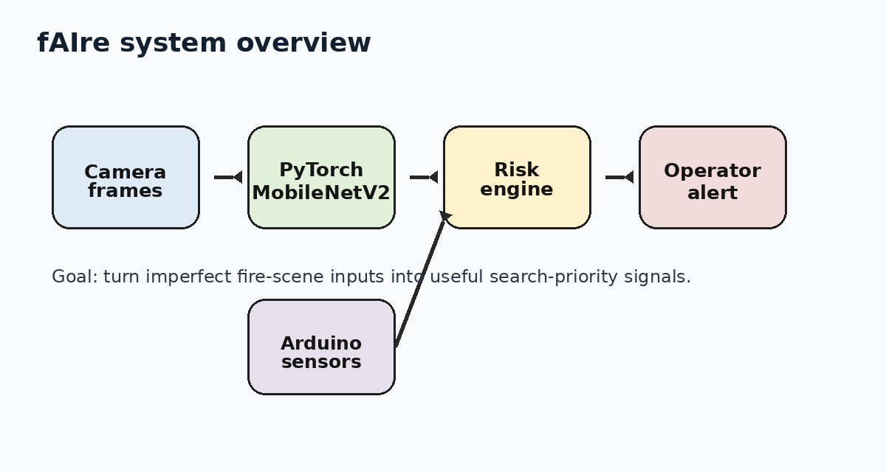

# Hardware build

The hardware side of fAIre is the robot/sensor layer that feeds the AI pipeline.

<p align="center">
  
</p>

## Prototype concept

The project is designed around a small rover or portable robot platform that can move or be placed into a risky area before a human enters. The robot streams camera frames and sensor readings to the software pipeline.

The public repo focuses on the reusable software and sensor interface. The exact physical build can change depending on available parts.

## Component map

| Component | Role in the system |
|---|---|
| Microcontroller | Reads low-level sensors and streams values over serial |
| Camera | Provides image/video frames for the CNN pipeline |
| Distance sensor | Estimates obstacle or wall distance for basic spatial awareness |
| Smoke/gas sensor | Adds environmental risk context |
| Temperature sensor | Adds heat severity context |
| Rover chassis / motors | Mobility layer for the robot prototype |
| Laptop / edge computer | Runs training, inference, or dashboard software |

## Serial sensor stream

The included Arduino sketch prints comma-separated sensor readings:

```text
temperature_c,smoke_raw,distance_cm
```

Example stream:

```text
31.20,420,85.40
32.15,438,79.10
33.05,461,74.55
```

The Python risk engine can combine those values with vision confidence.

## Arduino sketch

File:

```text
hardware/fire_robot_controller.ino
```

The sketch includes:

- ultrasonic distance measurement,
- analog smoke/gas reading,
- analog temperature reading,
- serial output every 250 ms.

The conversion formulas are intentionally simple so the sketch stays easy to modify for different sensors.

## Hardware-to-software flow

```text
Sensors + camera
      |
      v
Microcontroller serial stream + video frame
      |
      v
Python inference script
      |
      v
Risk score + priority alert
```

## Future hardware upgrades

- Thermal camera input.
- Better calibrated gas/CO sensor readings.
- Motor-control loop for autonomous scanning.
- Live serial parsing inside `inference/detect.py`.
- On-device inference using Raspberry Pi or Jetson-style hardware.
