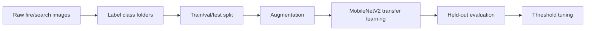

# Training process

This document explains how fAIre moves from a first prototype classifier to a reproducible training pipeline.



## 1. Starting point: Teachable Machine

The first version of the project used Google Teachable Machine to quickly test whether an image classifier could separate target fire/search scenes from background images. That was useful because it proved the idea quickly without needing a full ML codebase.

The limitation was control. Teachable Machine is good for prototypes, but it hides many important details: data splits, augmentations, checkpointing, evaluation metrics, and confidence-threshold tuning. The current repo moves those pieces into Python so the training process is reproducible and easier to explain.

## 2. Dataset format

The training code uses ImageFolder format:

```text
data/
  train/
    distress/
    no_distress/
  val/
    distress/
    no_distress/
  test/
    distress/
    no_distress/
```

Each folder name becomes a class label. Large datasets should not be committed to GitHub. Keep the raw dataset locally or in cloud storage, and commit only a few safe sample images showing the expected format.

## 3. Data preparation

Use:

```bash
python data/prepare_data.py --raw data/raw --out data --val-split 0.15 --test-split 0.15
```

This creates train, validation, and test folders. The test folder is held out until the end so the final numbers represent new images the model did not train on.

## 4. Model choice

The current training code uses **MobileNetV2 transfer learning**.

Why this makes sense:

- It is pretrained on a large image dataset, so it already understands general visual features.
- It is lightweight enough for a robotics/edge-computing roadmap.
- It is realistic for a project with hundreds or thousands of labeled images.
- It is easier to reproduce than a custom architecture.

## 5. Augmentation

During training, the script applies light augmentations:

- horizontal flip,
- brightness/contrast/saturation jitter,
- small rotation,
- resize and normalization.

This helps the model generalize across changing lighting, camera angle, smoke, and motion blur.

## 6. Training

Run:

```bash
python training/train.py --data data --epochs 10 --out models/fire_model.pt
```

Optional faster first run:

```bash
python training/train.py --data data --epochs 5 --freeze-backbone --out models/fire_model.pt
```

The script saves:

- `models/fire_model.pt` — trained PyTorch checkpoint,
- `models/fire_model.json` — metadata such as classes, image size, and validation accuracy.

## 7. Evaluation

Run:

```bash
python demo/evaluate.py --data data --weights models/fire_model.pt --threshold 0.50
```

The output includes:

- precision,
- recall,
- F1,
- support per class,
- confusion matrix.

It also saves:

```text
media/confusion_matrix.png
media/metrics.json
```

## 8. Why recall matters most

For fAIre, recall is the key metric. A high-recall model is better at catching true positive distress/person frames. Precision still matters, because too many false alarms can distract firefighters, but a false negative is the more dangerous failure mode.

That is why the project should report precision and recall separately instead of hiding behind accuracy.

## 9. What to write in the README after evaluation

After running evaluation, update the README with the real values:

```text
Precision: <measured value>
Recall: <measured value>
F1: <measured value>
Test images: <number of images in data/test>
Hardware: <device used for inference/evaluation>
```

Do not publish made-up metrics. Honest measured numbers are stronger than fake perfect numbers.
