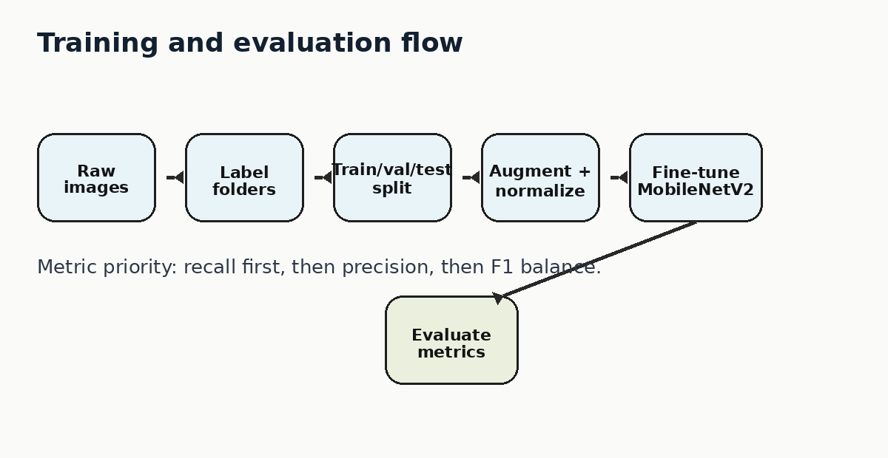

# Training process

This document explains how fAIre moves from raw images to a trained, evaluated PyTorch classifier.

<p align="center">
  
</p>

## 1. Prototype idea

The first version of fAIre used a simple image-classification workflow to test whether fire/search-scene images could be separated from background images. That prototype proved the idea quickly, but a real repo needs more control over training, data splits, checkpoints, and evaluation.

The current version moves the training pipeline into Python.

## 2. Dataset layout

The model expects `ImageFolder` format:

```text
data/
  train/
    distress/
    no_distress/
  val/
    distress/
    no_distress/
  test/
    distress/
    no_distress/
```

Each subfolder is treated as a class label. The class names can change, but the same labels must exist across train, validation, and test.

## 3. Prepare and validate data

Run:

```bash
python data/prepare_data.py --raw data/raw --out data --val-split 0.15 --test-split 0.15
python data/validate_dataset.py --data data
```

The preparation script:

- scans raw class folders,
- shuffles with a fixed seed,
- creates train/validation/test splits,
- resizes images to a square model input,
- keeps the split reproducible.

The validation script checks that the split folders exist, class labels match across splits, images are readable, class counts are visible, and exact duplicate files are flagged before training.

For a quick end-to-end software check without private images, the repo can create a tiny generated dataset:

```bash
python data/make_sanity_dataset.py --out data/raw_sanity --images-per-class 60
python data/prepare_data.py --raw data/raw_sanity --out data/sanity
python data/validate_dataset.py --data data/sanity
```

The synthetic sanity dataset is not a benchmark. It exists only to verify that data prep, training, and evaluation run correctly.

## 4. Model

The training script uses **MobileNetV2 transfer learning** through PyTorch and torchvision.

Transfer learning is the right fit because fAIre is a prototype dataset, not a million-image research dataset. MobileNetV2 already understands general image features such as edges, shapes, and textures. fAIre fine-tunes the classifier head for the project-specific labels.

## 5. Augmentation

Training uses light augmentation:

- horizontal flips,
- brightness/contrast/saturation jitter,
- small rotations,
- resize,
- ImageNet normalization.

This helps the model handle imperfect camera angles, lighting changes, and noisy fire-scene visuals.

## 6. Train

Run:

```bash
python training/train.py --data data --epochs 10 --out models/fire_model.pt
```

Optional faster run:

```bash
python training/train.py --data data --epochs 5 --freeze-backbone --out models/fire_model.pt
```

Outputs:

```text
models/fire_model.pt
models/fire_model.json
```

The checkpoint stores:

- model name,
- trained weights,
- class labels,
- image size,
- normalization values,
- validation history,
- best validation accuracy.

## 7. Evaluate

Run:

```bash
python demo/evaluate.py --data data --weights models/fire_model.pt --threshold 0.50
```

Outputs:

```text
media/confusion_matrix.png
media/metrics.json
```

Metrics reported:

- precision,
- recall,
- F1,
- support,
- confusion matrix.

## 8. Optional ONNX export

After training and evaluation, the PyTorch checkpoint can be exported for future edge-runtime experiments:

```bash
python training/export_onnx.py --weights models/fire_model.pt --out models/fire_model.onnx
```

This does not replace evaluation. It is just a deployment-prep step once the model is trained.

## 9. Threshold tuning

`demo/tune_threshold.py` shows how to choose a confidence threshold with a recall-first objective.

Run the built-in demo:

```bash
python demo/tune_threshold.py --demo --min-precision 0.80
```

The idea is simple: choose the lowest threshold that catches more true positives while keeping false alarms within a reasonable range.

## 10. Why recall matters

For fAIre, recall matters more than plain accuracy. If the robot misses a true distress/person frame, the system fails in the worst way. A false positive is annoying, but a false negative is dangerous.

That is why the project reports precision, recall, and F1 separately.
